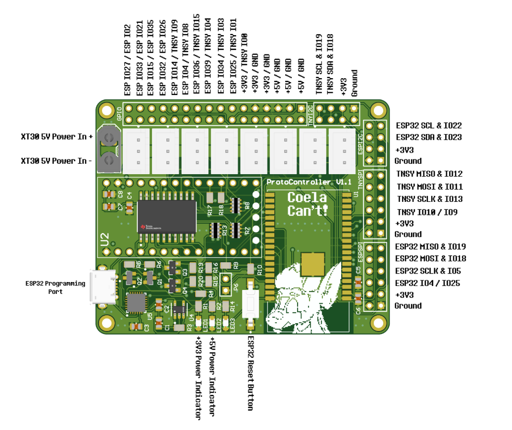
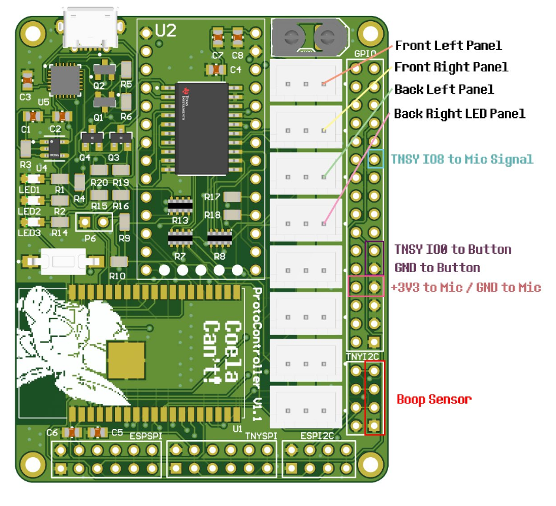
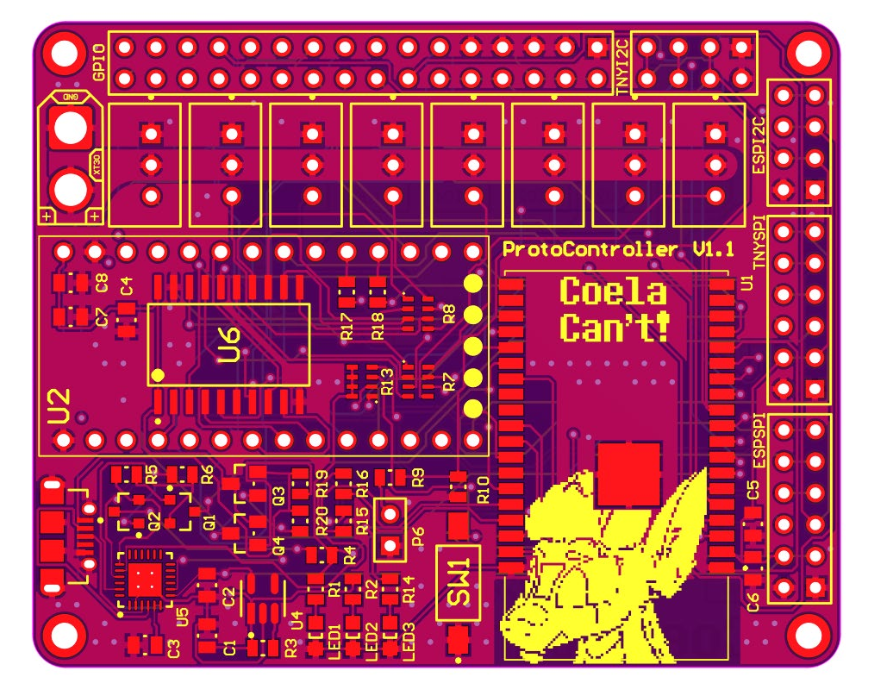
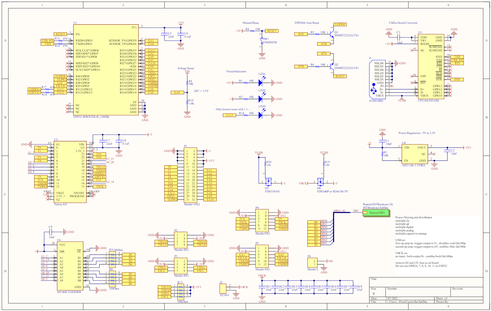

# ProtogenControllerV1
Protogen Controller V1 with Bluetooth

## General Information
This controller is used to control up to 8 WS2812 strips at 500 pixels long each. This supports an ESP32 WROVER used for communication to other wireless devices that talks to the Teensy 4.0 over Serial. Both devices have breakouts for I2C and SPI as well as all unused GPIO. The ESP32 is programmed over USB using the integrated CP2104 FTDI.

## Bill of Materials

| **RefDes**                                   | **Value**           | **Footprint** | **Quantity** | **Description**                                                                                       |
|----------------------------------------------|---------------------|---------------|--------------|-------------------------------------------------------------------------------------------------------|
| C1, C2, C3, C4, C5, C6, C7, C8, DC1, DC2, DC3, DC4, DC5, DC6, DC7, DC8 | CC0805KKX7R6BB105 | 0805          | 16           | CAP CER 1UF 10V X7R                                                           |
| J1                                           | 47589-0001          |               | 1            | Right Angle Female Type AB Micro USB Connector, 30 V, 1.8 A, -30 to 85 degC, RoHS, Tape and Reel      |
| J1_JSTBreakout1, J1_JSTBreakout2, J1_JSTBreakout3, J1_JSTBreakout4, J1_JSTBreakout5, J1_JSTBreakout6, J1_JSTBreakout7, J1_JSTBreakout8 | B3B-XH-A(LF)(SN) | 2.5MM         | 8            | CONN HEADER VERT 3POS |
| J2                                           | XT30-F              |               | 1            | XT30 Female connector for board mount                                                                 |
| LED1, LED2, LED3                             | 150080SS75000       |               | 3            | SMD mono-color Chip LED, WL-SMCW, Super Red                                                           |
| P1                                           | Header 16X2         |               | 1            | Header, 16-Pin, Dual row                                                                              |
| P2, P3                                       | Header 4X2          |               | 2            | Header, 4-Pin, Dual row                                                                               |
| P4, P5                                       | Header 6X2          |               | 2            | Header, 6-Pin, Dual row                                                                               |
| P6                                           | Header 2            |               | 1            | Header, 2-Pin                                                                                         |
| Q1, Q2                                       | MMBT2222ALT1G       | SOT-23        | 2            | General Purpose Transistor, NPN Silicon, 3-Pin, Pb-Free, Tape and Reel                                |
| Q3                                           | FDN339AN            | SSOT3         | 1            | MOSFET N-CH 20V 3A                                                                                    |
| Q4                                           | FDN340P             | SSOT3         | 1            | MOSFET P-CH 20V 2A                                                                                    |
| R1, R2, R3, R4, R5, R6, R9, R10, R14, R15, R16, R17, R18, R19, R20 | CRCW08050000Z0EA  |               | 15           |                                                                                   |
| R7, R8, R13                                  | CAT16-103J4LF       | 8-Pin SMD     | 3            | CAT / CAY 16 Series - Chip Resistor Array, 10 KOhm, +/- 5%, 50 V, -55 to 125 degC, RoHS, Tape and Reel |
| SW1                                          | FSMSMTR             | 2-Pin SMD     | 1            | FSMSM Push Button Switch, 50 mA, -35 to 85 degC, RoHS, Tape and Reel                                  |
| U1                                           | ESP32-WROVER-B_(16MB)|               | 1            | Generic WiFi-BT-BLE MCU module. Flash memory of 16 MB and PSRAM of 8 MB                              |
| U2                                           | Teensy 4.0          |               | 1            | RT1062 Teensy 4.0 i.MX ARM® Cortex®-M7 MPU Embedded Evaluation Board                                  |
| U4                                           | AP2112K-3.3TRG1     | SOT25         | 1            | IC REG LINEAR 3.3V 600MA                                                                              |
| U5                                           | CP2104-F03-GM       | 24-pin QFN    | 1            | Single-Chip USB to UART Bridge, 4 Dig I/O Pins, Internal Oscillator, 1024 Bytes EEPROM, -40 to 85 degC|
| U6                                           | SN74HCT245DWR       | 20SOIC        | 1            | IC TXRX NON-INVERT 5.5V                                                                               |

## Power Setup

### Powering the Teensy 4.0 for Programming
For programming the Teensy 4.0, the bottom VIN from VUSB trace needs to be cut to not provide power to the LED boards and cause damage while programming.

### Powering the Controller for Usage
To use the controller, 5V must be provided to the XT30 connector. Make sure you follow the standards for the XT30 polarity!

## Sensors/Peripherals

### Boop Sensor (APDS-9960)
The APDS-9960 is a Time-of-Flight sensor that uses an IR light to measure the distance to the object in front of it using the I2C communication protocol. This can be connected on either the Teensy I2C breakout or the ESP32 I2C breakout. The following picture shows the recommended location for the device:

### MAX9814 Microphone
The MAX9814 electret microphone is a standard electret microphone with automatic gain compensation via an amplifier. This will pick up a varying range of sounds and not just your voice, so it is best to tune the software gain appropriately.

### Control Button
The control button is a simple button that allows you to toggle between faces. There is no analog filtering on the button with the kit as the button debouncing is handled in code within the ButtonHandler class.

### I2C OLED Display
The OLED display is a small display for mounting within the visor for the wearer to see. It is used to display the current face being displayed on the outside, status of a battery, or anything else you like. This will communicate over I2C with either the Teensy or the ESP32.

## Programming the Teensy

### Getting Started with ProtoTracer

#### Install Applications
- Install Visual Studio Code from here: [Visual Studio Code](https://code.visualstudio.com/)
- Install TeensyDuino from here: [TeensyDuino](https://www.pjrc.com/teensy/td_download.html)

#### Install Extensions
- Install PlatformIO IDE under the extensions in Visual Studio Code.
- Install C/C++ extension.

#### Download the Codebase
Download ProtoTracer from here: [ProtoTracer](https://github.com/coelacant1/ProtoTracer). You can use either the Zip download or clone it to a local Git repository.

## General Recommendations and Notes
- Do not use external power to the XT30 connector, unless it is 5V directly, the controller should be able to handle 4.5V to 5.5V but anything else is outside of specification.
- Do not short circuit the IO pins. Be careful about which pins are in use and are listed at the beginning of the guide.
- Be careful leaving the electronics in a humid environment.

## Images

### 3D View

### Wiring

### Layer View

### Electrical Schematic
